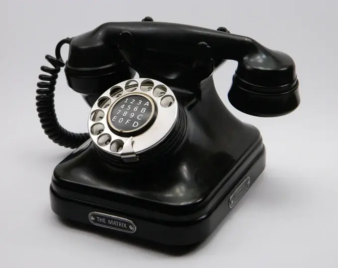
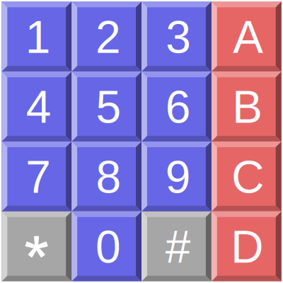
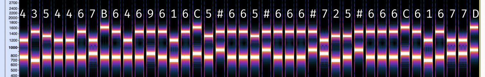

# dual-type-multi-format

## Challenge

A new riff on an old format.

[hello.webp](./hello.webp)


## Solution

I started by taking a look at the provided image, shown below:

<br>

Using the [Extract Files](https://cyberchef.io/#recipe=Extract_Files(true,true,true,true,true,true,false,true)) function of [CyberChef](https://cyberchef.io), I found that a [WAV file](./extracted_at_0x3c02) containing dial tones was hidden inside of [hello.webp](./hello.webp).  I'd encountered these kinds of tones before in past challenges, and had found that I had the most luck with a site called [dtmf-detect](https://unframework.github.io/dtmf-detect/).  Running the file through the tool found here decodes the tones into  `435446764696165#665#666#725#66661677`.

\* *Note that when decoding long DTMF sequences, with the tool mentioned above the decoded sequence might not all be visible because the output box doesn't expand to fit them all.  If you double click the numbers, even the ones that aren't visible will be selected and you can copy them to be pasted elsewhere.  Also note that the output will reset a few seconds after the recording ends, so you'll need to grab them quickly.*

Once I had the decoded sequence from the tone, I made the assumption that it probably needed to be decode using the keypad in the picture somehow.  One thing that I found interesting was that entering the code in [https://www.dcode.fr/cipher-identifier](https://www.dcode.fr/cipher-identifier) lists Nihilist Cipher as the top hit, which uses a grid much like the one in the picture as a key.  I couldn’t get it to work with the code, but thought that perhaps I needed to look for something similar.  The phone in the image does say “The Matrix” at the bottom so I thought that could be some sort of hint at a matrix cipher of some type.  The challenge was categorized as forensics and not crypto though, so I had some doubts.

The next thing I noticed was that all of the values on the keypad were valid hexadecimal values.  Based on this, it seemed possible that decoding from hexadecimal would come into play at some point.

Another possibility I considered was if the tones somehow mapped to the 4x4 keypad of the phone in the image, rather than that of a standard 3x4 keypad.

I started digging deeper into the audio itself, and found that there were a few extra tones that hadn't been recognized by the decoder.  Running the audio through the tool again, I watched for tones that decode into anything, and mapped everything onto a screenshot of the audio's spectrogram in [Audacity](https://www.audacityteam.org):


So really the decoded sequence should be  `4354467_6469616_5#665#666#725#666_61677_`, with the blanks being the unknown values.

At this point, I started learning a little more about [DTMF tones via Wikipedia](https://en.wikipedia.org/wiki/Dual-tone_multi-frequency_signaling).  DTMF stands for "dual-tone multi-frequency," which explains why each tone has two bands for each tone—each tone is really a set of two tones at different frequencies.  As I scrolled through the Wikipedia page, I saw an image that stood out:



This keypad was a 4x4 layout, just like the one in the image!  As it turns out, DTMF codes were originally intended for devices with this type of 4x4 keypad.  Also in the Wikipedia article, I found a table of [DTMF keypad frequencies](https://en.wikipedia.org/wiki/Dual-tone_multi-frequency_signaling#Keypad):

|            | **1209 Hz** | **1336 Hz** | **1477 Hz** | **1633 Hz** |
|:----------:|:-----------:|:-----------:|:-----------:|:-----------:|
| **697 Hz** |      1      |      2      |      3      |      A      |
| **770 Hz** |      4      |      5      |      6      |      B      |
| **852 Hz** |      7      |      8      |      9      |      C      |
| **941 Hz** |      *      |      0      |      #      |      D      |

Using this table, I was able to look at the spectrogram and decode the 4 unknown tones.



Filling in the blanks, the sequence becomes `4354467B6469616C5#665#666#725#666C61677D`.
This is almost a valid hexadecimal sequence, but one change needs to be made.  Since the letter `F` shows up in [hello.webp](./hello.webp) in the same position as `#` on a standard keypad, I replaced all the `#` signs in the sequence with `F`, resulting in  `4354467B6469616C5F665F666F725F666C61677D`.

Now that I had a valid hex sequence, I converted it to ASCII.  This can be done using [CyberChef](https://cyberchef.io/#recipe=From_Hex('Auto')&input=NDM1NDQ2N0I2NDY5NjE2QzVGNjY1RjY2NkY3MjVGNjY2QzYxNjc3RA) or the command below.

```sh
echo 4354467B6469616C5F665F666F725F666C61677D | xxd -r -p
```

The decoded sequence is the flag: `CTF{dial_f_for_flag}`
