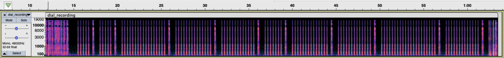
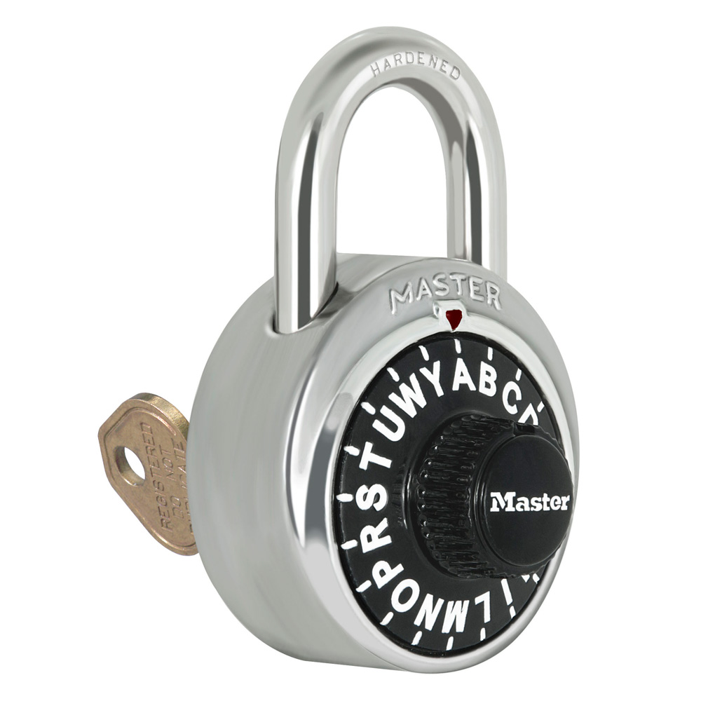

# lph

## Challenge

Help, I'm locked out but I have a recording from the lph!

[lph.tar.gz](./lph.tar.gz)<br>
`├──` [dial_recording.mp3](./lph_extracted/dial_recording.mp3)<br>
`├──` [flag.txt](./lph_extracted/flag.txt)<br>
`└──` [photos](./lph_extracted/photos/)

##### Challenge Clarification

A challenge clarification was issued partway through the CTF, after I had already solved the challenge.  I personally think the clarification gave away a little too much detail on the required steps for solving the challenge, but obviously it would have been to my advantage for less people to be able to solve it.  Hopefully my solution below will show how most of the clarification details can be figured out based on the challenge alone.

> <details>
  > <summary>lph challenge clarification</summary>
  > For <code>lph</code> the combination dialed is not a "real" combination that would open the lock. English words were spelled out on the dial but the general rules that combination locks follow would have required that the dial was spun around too much in order to support a combination so long. I took shortcuts to make your lives easier. There is a picture of the lock used. You will be able to narrow down the possible combinations to fewer than 100. The correct combination should stand out as the one that is readable English that makes sense.
> </details>

## Solution

We'll start by going through the various files provided.

### [dial_recording.mp3](./lph_extracted/dial_recording.mp3)

Listening to [the recording](./lph_extracted/dial_recording.mp3), you'll hear the following:
- An introduction: "Hi this is the lock picking hacker and today I'm going to dial a combination for you."
	- This is a reference to [LockPickingLawyer](https://www.youtube.com/c/lockpickinglawyer) on YouTube.  That's not particularly important to the challenge, but I do highly recommend his videos.
- The sound of a dial turning.
	- Probably to reset the lock.  Many combination locks require you to do a few full turns before entering the actual combination.
- A series of sets of clicks, with each set ending in the sound of the dial turning.
	- These clicks are very distinct, all sound about the same, and occur at about the same rate apart.  We'll go into this more below.

Looking at a spectrogram of the recording, we'll see the same characteristics of the clicks as mentioned above:



This confirms that the recording probably was probably engineered in some way, and isn't a literal recording.  This means it's possible the combination isn't being entered exactly as a real combination might be.

Looking at the spectrogram also made it a lot easier to determine the number of clicks for each set of clicks, which is as follows:

```
[5, 5, 17, 14, 13, 7, 14, 13, 21, 13]
```

### [flag.txt](./lph_extracted/flag.txt)

[flag.txt](./lph_extracted/flag.txt) reads:

```
CTF{<combo_in_uppercase>}
```

Rather than a numeric combination, it looks like the combination will be an alphabetical one.

### [photos](./lph_extracacted/photos/)

If you look through the [photos](./lph_extracted/photos/) directory, you’ll see that there’s only one image that doesn’t follow the naming pattern of the others, [m1573l.jpg](./lph_extracted/photos/m1573l.jpg).  This image is also the only one of a combination lock (all the others are of padlocks).  From there I assumed that it was safe to say that the lock pictured in [m1573l.jpg](./lph_extracted/photos/m1573l.jpg) was the one being used in the recording.

[m1573l.jpg](./lph_extracted/photos/m1573l.jpg):

<br>

One important thing to note about this lock is that although has letters instead of numbers on the dial,
it does not include every letter in the alphabet.  Based on the image we are given, we can tell that it excludes `J`, `K`, `Q`, `V`, `X`, and  `Z`.  Part of the dial isn't visible in the image, so I double checked that these were the only excluded letters by looking up the model number based on the image's filename.

Searching for `Masterlock 1573l` leads us to [the product page](https://www.masterlock.com/products/product/1573) where we can verify that `ABCDEFGHILMNOPRSTUWY` is the correct alphabet for our lock.

### Simulating the Combination Input

From here, it's time to write a script to simulate the combination input based on everything we know.
 As we do so, there will be a number of different questions to take into consideration:
 - What was the starting position for the dial?
 - Does the starting position reset after each letter, or continue from the position of the preceding letter?
 - Which direction is the dial turning initially, and does it swap direction after each letter in the combination?
- Does the sound of the dial turning after each set of clicks count as an additional click?

Working through all of these questions took a bit of trial and error (attempting different combinations of answers to the questions above, then looking through the output to see if it contained anything that made sense).  The code below is what I ended up with, but you should be able to see where it would be pretty easy to modify it if any of the questions above needed to be answered differently.

```python
# letters on the dial, in order; note that JKQVXZ are excluded as they do not appear on the dial
alphabet = 'ABCDEFGHILMNOPRSTUWY'

# number of short clicks in each set of clicks in the recording
clicks = [5, 5, 17, 14, 13, 7, 14, 13, 21, 13]

# initial direction to turn is right.  Set to False for left
right = True

# iterate through different starting positions on the dial
for value in range(0, len(alphabet)):  
	for c in clicks:
		if right:
			# increase position by that many clicks, plus one for the big click at the end
			value += c + 1
		else:
			# decrease position by that many clicks, plus one for the big click at the end
			value -= c + 1

		# reverse turning direction after each letter
		right = not right

		# print the character at that position on the dial; the mod (%) makes it so the position "wraps around" if value is negative or larger than 20
		print(alphabet[value % (len(alphabet))], end='')

	# start a new line
	print()
```

The outer `for` loop iterates through all the possible starting positions, so we end up with the following output:

```
GAWDULEMOW
HBYEWMFNPY
ICAFYNGORA
LDBGAOHPSB
MECHBPIRTC
NFDICRLSUD
OGELDSMTWE
PHFMETNUYF
RIGNFUOWAG
SLHOGWPYBH
TMIPHYRACI
UNLRIASBDL
WOMSLBTCEM
YPNTMCUDFN
AROUNDWEGO
BSPWOEYFHP
CTRYPFAGIR
DUSARGBHLS
EWTBSHCIMT
FYUCTIDLNU
```

Most of the possible combinations seem to be meaningless, but one of them makes sense: `AROUNDWEGO`.  Following the format from [flag.txt](./lph_extracted/flag.txt) we get `CTF{AROUNDWEGO}`
