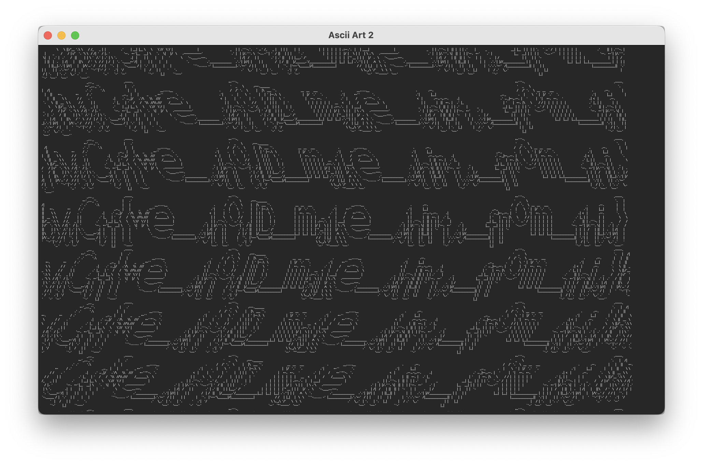

# ASCII Art 2


## Challenge

Not so easy now, is it??

[ascii2.txt](./ascii2.txt)

## Solution

In the first [ASCII Art](./asciiart) challenge, we were lucky enough to be given indicators of where line breaks should be inserted.  In this case, the provided text file again contains a single line, but this time without any indicator of how it should be split up.

I began by opening the file in a text editor with line wrapping turned on, hoping that I could manually adjust the window size so that the text would break into new lines and reveal the ASCII art.  Unfortunately, this method required a level of precision that just didn't seem possible.

Next I tried using the [`fold`](https://linux.die.net/man/1/fold) command in my terminal, with the text file as the input.  I experimented with a few different wrap widths, and found that I seemed to be getting closer, but would need to try a lot of different widths in order to find the correct one.

Using a `for` loop, I was able to run `fold`  multiple times, iterating through different widths:

```sh
for i in {1..600}:
do
	fold -w $i ascii2.txt
done
```

I probably could have started the width at something much higher than 1, but I did it anyway for the grandeur of it.

After running the loop, all I had to do was scroll through the output until I found something that looked right:


