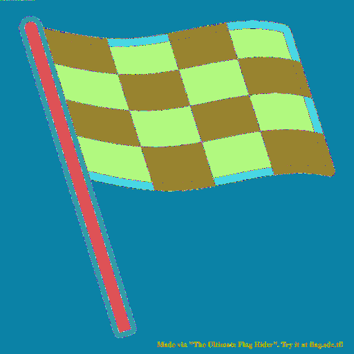

# Free Flag

###### Writeup by [danieltaylor](https://github.com/danieltaylor)

## Challenge

We are so generous that we literally decided to give you a free flag on a challenge other than sanity check.

##### Free flag!!
[freeflag.png](./freeflag.png)

## Solution

If you run [freeflag.png](./freeflag.png) through [Cyberchef's Randomize Color Palette function](https://gchq.github.io/CyberChef/#recipe=Randomize_Colour_Palette('')), you may notice some unique pixels hiding in the top left corner of the image:



Using the [Python Image Library](https://pillow.readthedocs.io/en/stable/), we can find the values of the pixels in the top left of the original image.  The code below will print out the values of the first row of pixels:

```python
from PIL import Image

with Image.open('freeflag.png') as image:
	for y in range(1):
		for x in range(image.size[0]):
			print(image.getpixel((x, y)))
```

Running the code reveals the pixels to have the following values (in `(R,G,B,A)` format):

```
(3, 2, 1, 2), (2, 3, 0, 0), (2, 2, 1, 2), (3, 3, 0, 0), (2, 3, 1, 0), (3, 2, 1, 3), (1, 2, 1, 2), (3, 3, 0, 0), (3, 0, 1, 2), (2, 3, 1, 2), (3, 0, 0, 0), (2, 3, 1, 1), (0, 3, 1, 3), (2, 3, 1, 2), (3, 2, 1, 0), (0, 2, 0, 2), (1, 2, 0, 0), (0, 2, 0, 1), (1, 2, 0, 3), (1, 3, 1, 3), (0, 2, 0, 2), (2, 3, 1, 1), (0, 3, 0, 0), (1, 3, 1, 3), (0, 2, 1, 2), (2, 3, 0, 1), (3, 0, 0, 0), (3, 2, 1, 2), (3, 0, 1, 2), (2, 3, 0, 0), (1, 3, 1, 3), (1, 2, 1, 2), (1, 2, 1, 0), (0, 2, 1, 2), (1, 3, 1, 3), (0, 2, 0, 2), (3, 2, 1, 0), (2, 3, 0, 2), (1, 3, 1, 3), (0, 2, 0, 2), (1, 3, 1, 3), (0, 3, 1, 0), (1, 3, 0, 2), (0, 3, 1, 1), (1, 3, 1, 3), (0, 2, 1, 2), (3, 0, 0, 0), (2, 3, 0, 3), (2, 2, 1, 0), (3, 0, 0, 0), (3, 3, 0, 3), (0, 0, 0, 0)...
```

The watermark at the bottom right of [freeflag.png](./freeflag.png) refers to "The Ultimate Flag Hider" at [flag.sdc.tf](https://flag.sdc.tf).  Going to that website and submitting an image allows us to hide text in images in the same way that the flag was hidden in [freeflag.png](./freeflag.png).  By submitting a blank image with the same dimensions as [freeflag.png](./freeflag.png) (I had issues when I tried it with a smaller image), we can start to reverse engineer the input text that was used to create [freeflag.png](./freeflag.png).

[empty.png](./empty.png) is a 512x512 image with all `(0,0,0,0)` pixels.  We can figure out what we need to know about how the flag hider works with just two different inputs: `A` and `BA`.  The first five pixels of the outputs, [A.png](./A.png) and [BA.png](./BA.png), are as follows:

- [A.png](./A.png): `(0, 2, 0, 2), (0, 0, 0, 0), (0, 0, 0, 0), (0, 0, 0, 0), (0, 0, 0, 0)`
- [BA.png](./BA.png): `(0, 2, 1, 0), (0, 2, 0, 2), (0, 0, 0, 0), (0, 0, 0, 0), (0, 0, 0, 0)`

Based on these outputs, we can determine that each modified pixel corresponds to a letter in the input, and that the value associated with each letter stays the same regardless of the position of the letter.  Using this info, we can now create a key to decrypt [freeflag.png](./freeflag.png)!

We start with an empty image, just as we did before, but this time we will use an input of `abcdefghijklmnopqrstuvwxyzABCDEFGHIJKLMNOPQRSTUVWXYZ0123456789_{}`—all the characters we believe may be hidden in [freeflag.png](./freeflag.png).  The result is [abcdefghijklmnopqrstuvwxyzABCDEFGHIJKLMNOPQRSTUVWXYZ0123456789_{}.png](abcdefghijklmnopqrstuvwxyzABCDEFGHIJKLMNOPQRSTUVWXYZ0123456789_{}.png).  Using this image, we can now map all of the input characters to their respective values.  The code below takes care of this, and then decrypts the pixels in [freeflag.png](./freeflag.png):

```python
import sys
from PIL import Image

chars = 'abcdefghijklmnopqrstuvwxyzABCDEFGHIJKLMNOPQRSTUVWXYZ0123456789_{}'
key = dict()

with Image.open('abcdefghijklmnopqrstuvwxyzABCDEFGHIJKLMNOPQRSTUVWXYZ0123456789_{}.png') as flag:
	for y in range(1):
		for x in range(len(chars)):
			key[flag.getpixel((x, y))] = chars[x]

with Image.open('freeflag.png') as flag:
	for y in range(1):
		for x in range(flag.size[0]):
			if flag.getpixel((x, y)) == (0, 0, 0, 0):
				break
			print(key[flag.getpixel((x, y))], end='')

print()
```

Running the code reveals the flag to be `sdctf{St3g0nOgrAPHY_AnD_Cl0s3d_SRC_Are_A_FUN_C0mb0}`
