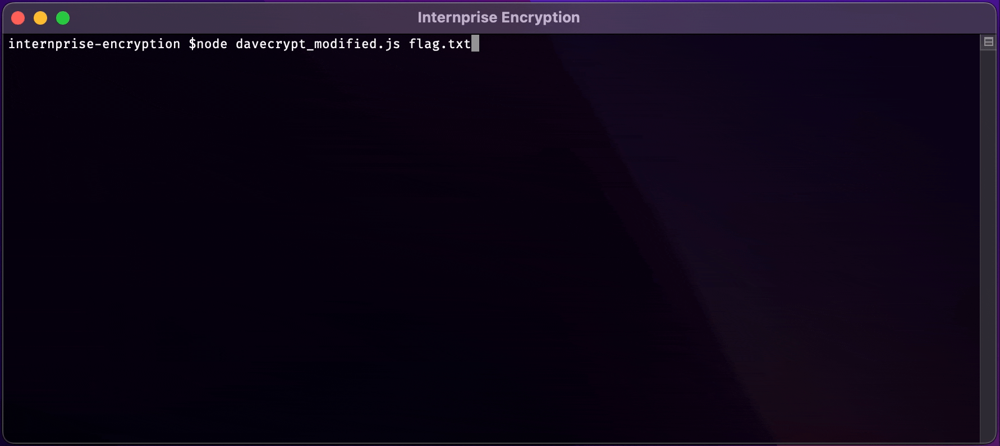
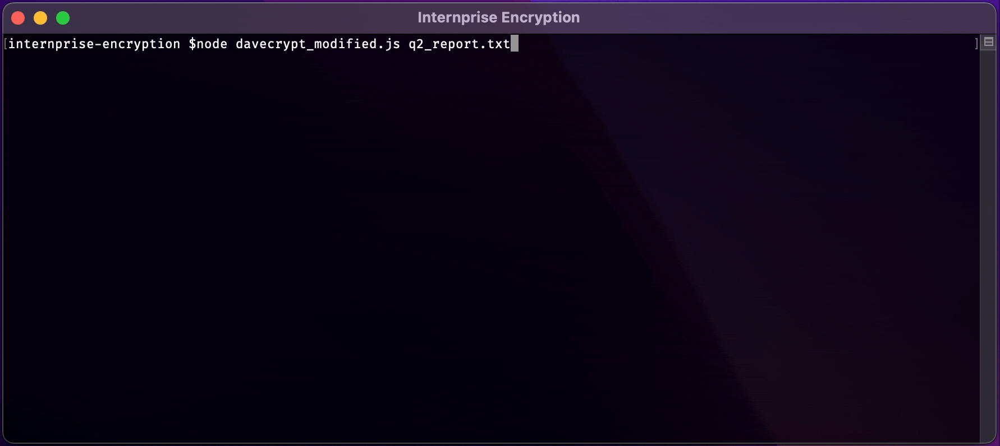

# Internprise Encryption


## Challenge

Our new intern Dave encrypted all of our important company files with his homemade "military grade encryption scheme" to try and improve company security. The thing is... he didn’t make the “decryption” part and we didn’t make backups.

[davecrypt.js](./davecrypt.js)<br>
[flag.txt](./flag.txt)<br>
[q2_report.txt](./q2_report.txt)<br>
[shareholder_meeting_script.txt](./shareholder_meeting_script.txt)

## Solution

For this challenge, its a good idea to run through some sample inputs  just to get an idea of how the encryption algorithm works.  Even just adding a line such as `console.log(encrypt('aaa'))` to the end of [davecrypt.js](./davecrypt.js) and running the file (e.g. `node davecrypt.js`) will give us a lot of information.  In doing this, we see that `aaa` encrypts into `È9`.  If we change the line we added to `console.log(encrypt('aaaaa'))`, we see that the output becomes `È9ï&`.  This tells us two key things about the encryption algorithm: 1) it cannot be solved with a one-to-one mapping of characters, as with a substitution cipher, and 2) appending to the input does not affect how any preceding characters get encrypted.

Based on what we saw above, we have enough information to suggest that we can rebuild the input (plaintext) one character at a time, trying each possible character until the resulting ciphertext matches the the provided ciphertext up to that point.

#### Code

I was able to achieve this by adding the following onto the end of [davecrypt.js](./davecrypt.js):

```js
const fs = require('fs')

// read in the text of an input file to `ciphertext` (pass the filename as an argument)
let ciphertext = fs.readFileSync(process.argv.slice(2).toString(), 'utf8')
// what has been decrypted so far
let decrypted = ''

// characters to try (taken from Python's string.printable)
let charset = '0123456789abcdefghijklmnopqrstuvwxyzABCDEFGHIJKLMNOPQRSTUVWXYZ!"#$%&\'()*+,-./:;<=>?@[\\]^_`{|}~ \t\n\r\x0b\x0c'

// for each character in the input file
for (let j = 0; j < ciphertext.length; j++) {
	// for each character to try
	for (let i = 0; i < charset.length; i++) {
		// encrypt what has been decrypted so far, plus the next character to try
		var encrypted = encrypt(decrypted + charset.charAt(i))

		// if the encrypted text matches the input file up to that point;
		// i.e. the character attempted above is correct
		if (encrypted == ciphertext.substring(0, decrypted.length + 1)) {
			// append the character to the decrypted text
			decrypted += charset.charAt(i)
			// clear the console and output the decrypted text plus what has yet to be decrypted
			console.clear()
			console.log(decrypted + ciphertext.substring(decrypted.length + 1))
			// move on to the next character in the ciphertext to be decrypted
			break
		}
	}
}
```

#### Demo

Here are some demos of running the script on each of the files that we were given:

##### [flag.txt](./flag.txt)



The flag can be found is found within the decrypted message: `sdctf{D0n't_b3_a_D4v3_ju5t_Use_AES_0r_S0me7h1ng}`

##### [q2_report.txt](./q2_report.txt)



##### [shareholder_meeting_script.txt](./shareholder_meeting_script.txt)


This last one is where you can see that the script starts to break down.  It appears that parts of the original text are missing from the result.  One reason for this could be if the original file contained symbols that weren't included in the charset used for decryption.
